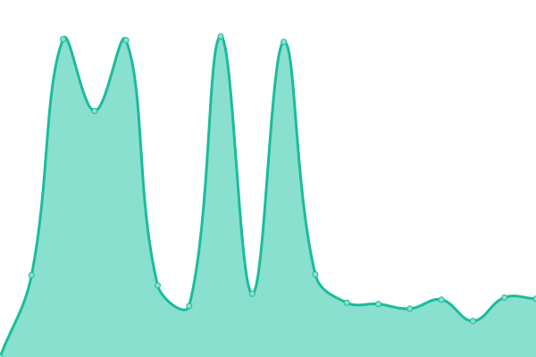
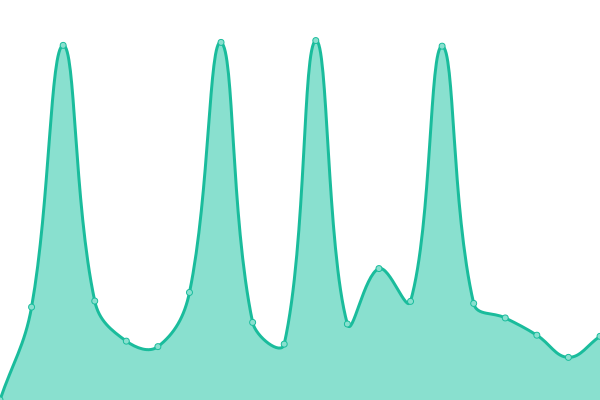
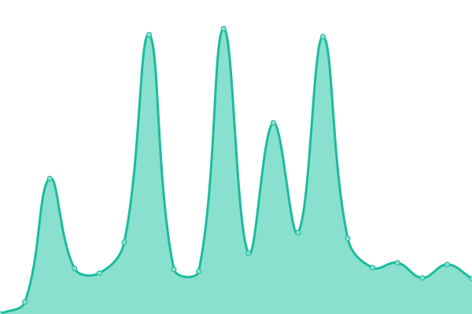

# [📈 Live Status](https://status.gbaranski.com): <!--live status--> **🟧 Partial outage**

This repository contains the open-source uptime monitor and status page for [Grzegorz Baranski](gbaranski.com), powered by [Upptime](https://github.com/upptime/upptime).

With [Upptime](https://upptime.js.org), you can get your own unlimited and free uptime monitor and status page, powered entirely by a GitHub repository. We use [Issues](https://github.com/gbaranski/upptime/issues) as incident reports, [Actions](https://github.com/gbaranski/upptime/actions) as uptime monitors, and [Pages](https://status.gbaranski.com) for the status page.

<!--start: status pages-->
<!-- This summary is generated by Upptime (https://github.com/upptime/upptime) -->
<!-- Do not edit this manually, your changes will be overwritten -->
<!-- prettier-ignore -->
| URL | Status | History | Response Time | Uptime |
| --- | ------ | ------- | ------------- | ------ |
|  [Plausible](https://plausible.gbaranski.com/api/health) | 🟥 Down | [plausible.yml](https://github.com/gbaranski/upptime/commits/HEAD/history/plausible.yml) | 

 1423ms
     
 | 

<a href="https://status.gbaranski.com/history/plausible">99.46%</a>
    

|  [Where To Park - Database](https://database.wheretopark.app/health) | 🟩 Up | [where-to-park-database.yml](https://github.com/gbaranski/upptime/commits/HEAD/history/where-to-park-database.yml) | 

 1206ms
     
 | 

<a href="https://status.gbaranski.com/history/where-to-park-database">98.31%</a>
    

|  [Where To Park - Web App](https://web.wheretopark.app) | 🟩 Up | [where-to-park-web-app.yml](https://github.com/gbaranski/upptime/commits/HEAD/history/where-to-park-web-app.yml) | 

 1112ms
     
 | 

<a href="https://status.gbaranski.com/history/where-to-park-web-app">98.32%</a>
    

<!--end: status pages-->

[**Visit our status website →**](https://status.gbaranski.com)

## 📄 License

- Powered by: [Upptime](https://github.com/upptime/upptime)
- Code: [MIT](./LICENSE) © [Grzegorz Baranski](gbaranski.com)
- Data in the `./history` directory: [Open Database License](https://opendatacommons.org/licenses/odbl/1-0/)
